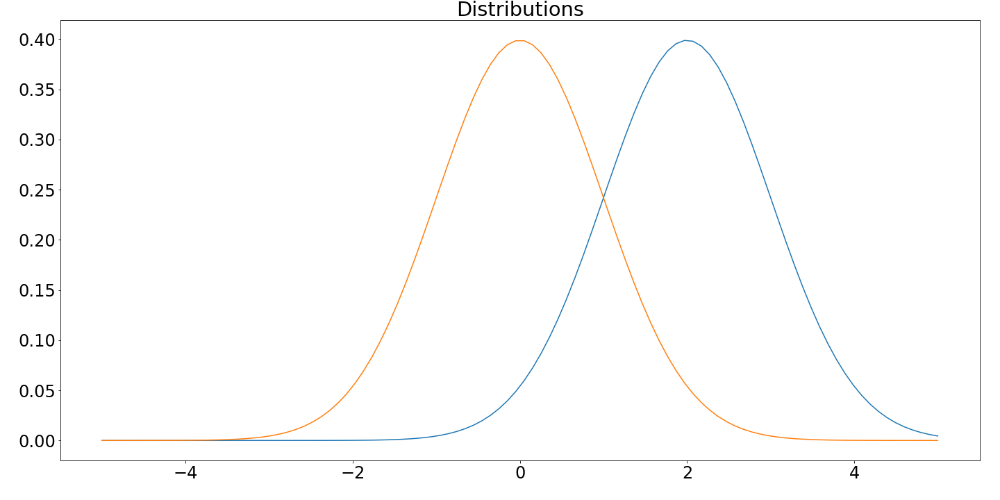
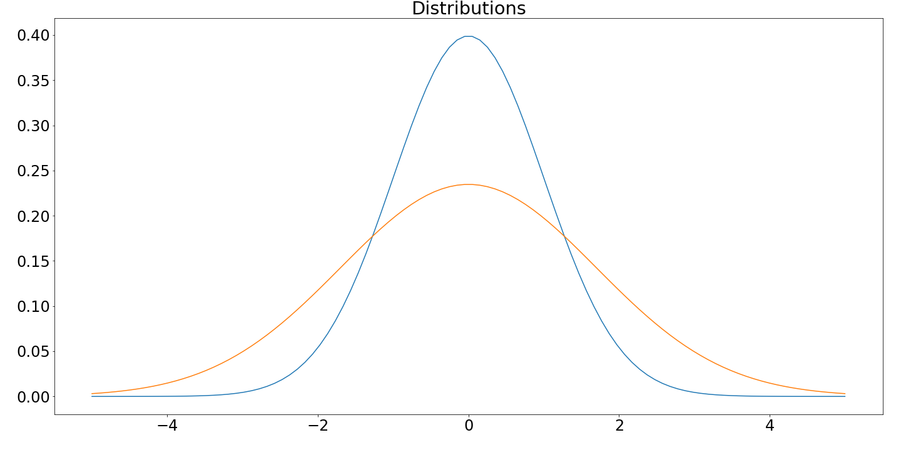

# Enceph

## Encephalization

One of the most prominent factors that distinguishes humans from the rest of the animal kingdom is our large encephalization levels. The encephalization quotient, or EQ, is a relative brain-size measurement that is composed by taking a ratio between brain mass and body mass. In other words, an average regression line will predict an animal's brain size based on their body weight, and humans, due to their (relatively) large brains, fall far above the regression line. The degree of these residuals is thought to be a predictor of intelligence.

## Evolution of Brain: Mass, Size, and Composition/Orientation

Nota bene...

Although brain mass (relative to body size) is one predictor of intelligence, there are many other anatomical factors that contribute to a species' degree of 'intelligence.' Brain size, measured as endocranial volume (cc or cm^3), is a measurement that is often recorded and noted, especially with extinct species where the entirety of the brain has decomposed, leaving us with only a fossilized brain case, or pieces of the skull. (As of this moment, all of the data collected for this research specifically address endocrancial volume.)

However, the most distinct (and influential) anatomical factor that can predict an animal's intelligence is the composition, orientation, and complexity of the brain. Although we do not have brain remnants from extinct ancestral hominins, contrastive analyses between modern-day humans and apes that share a near last common ancestor (LCA) (e.g. chimpanzees, bonobos, and gorillas) can give us insight into the unique anatomical developments that humans have acquired over the past 7 million years. The most notable of these is the neocortex (Derived from Latin: "neo"--new; "cortex"--structure resembling bark), which has grown larger and developed many more cortical folds, permitting a small brain case to hold a large amount of neural matter.

These factorial complexities make it clear that there is no one way to predict intelligence. However, the exponential increase in human brain mass, size, and complexity are clearly correlated with our rapid evolution.

## Objectives

The goal of this project is to explore this hominin evolution through mathematics (statistical analyses) and code. Then, we will take what we infer (since we <i>know</i> very little) about human evolution, and develop/support hypotheses about the causes and results of this accelerated brain evolution.

Due to the extreme and exponential growth of hominin brain size in the past 7 million years, it is clear that brain size is a directional selection, meaning that natural selection selects for larger brains, and as time progresses, the mean, and thus the entire (normal) distribution, shifts. This is clearly due to the benefits of larger brain capacity: larger brains (in hominins) are correlated with higher intelligence (more space to develop and store neurons). Figure 1 displays an example of a directional distribution, where the orange line depicts the original/earlier distribution and the blue line depicts the derived/new distribution:

However, I also began to wonder what other observations could be made about the data. My initial hypothesis is that brain size is not only a directional selection, but also a <i>stabilizing selection</i>. A stabilizing selection occurs when the distribution shifts in favor of the mean; in other words, less variance is preferred over more variance for a trait in a population. Figure 2 displays an example of a stabilizing distribution, where the orange line depicts the original/earlier distribution and the blue line depicts the derived/new distribution:

## Notes on Data Collection
<<<<<<< HEAD
=======

This data was collected from primary, secondary, and tertiary sources, ranging anywhere from scholarly articles to textbooks and lecture notes. For this reason, the data will likely contain repeats of the same data. The data also likely contains different estimates of (1) the approximate endocranial volume of the same specemins, and (2) the predicted time of the same specemins; (the processes of declaring these values are, after all, highly dependent on the researchers subjectivity, especially when the fossils are old, few, and/or incomplete). Finally, when a range was presented, I inserted the high and low values (I thought to create an individual normal dataset for each of these ranges, but decided it was outside the scope of the project). None of these are by any means good data collection practice, and I am aware of this, but this project is for exploration, and its nature is not decisive nor conclusive. I would love to hear advice on the ways you would reccomend that I increase the data set size with better practices. 

All sources have been cited in APA style, except the lectures, which are in my make-shift quasi-APA. These citations can be found on the 'references' document in /enceph. 
>>>>>>> ca9810d1528f4807595e90544b91c131f0ac39fc
